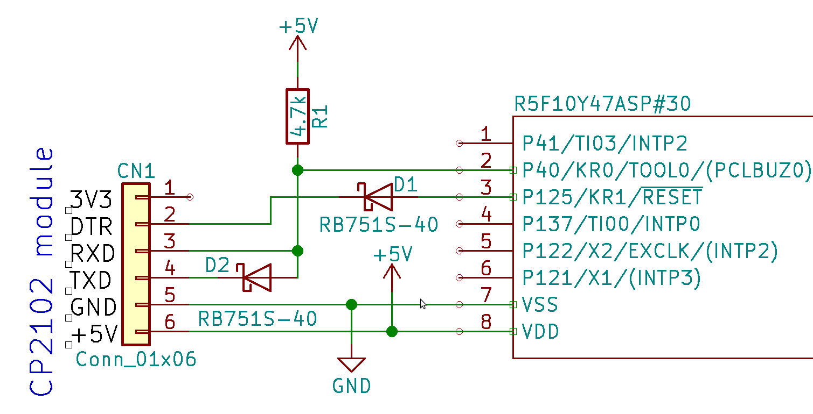

# RL78_G10_R5F10Y47ASP samples
## Data sheet  
Data sheet can be found here:  
https://www.renesas.com/en-eu/doc/products/mpumcu/doc/rl78/r01ds0207ej0310-rl78g10.pdf  
Users manual can be found here: (only in Japanese)  https://www.renesas.com/ja-jp/doc/products/mpumcu/doc/rl78/r01uh0384jj0311-rl78g10.pdf  
Convenient DIP module can be found here: (only in Japanses) http://akizukidenshi.com/catalog/g/gK-09035/   

## Flashing  
### Writing hardware  

### Writing software  
rl78g10flash tool can be found here: 
https://github.com/msalau/rl78flash/releases  
#### How to rl78g10flash  
After make command, you can **make deploy**. 

## GCC tool chain  
### binary
Renesas GNU tools can be found here: 
https://gcc-renesas.com/ja/rl78/rl78-download-toolchains/  
But you need to get free activation code from e-mail.
